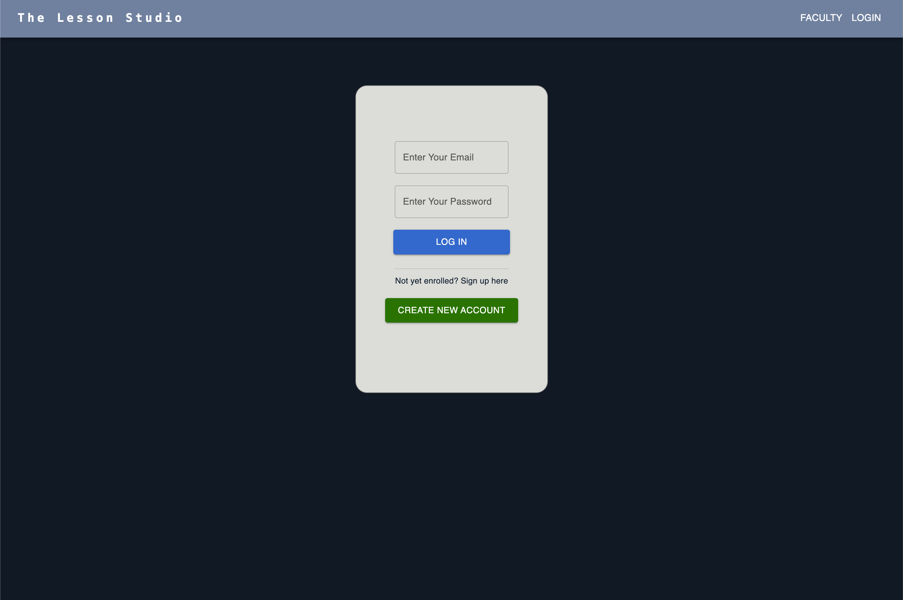

# The Lesson Studio :musical_note:

## Description

This application allows students to schedule music lessons with instructors.

## Usage

- npm install
- pipenv install && pipenv shell
- _to setup the database:_
- flask db init
- flask migrate -m _'comment'_
- flask db upgrade
- _to seed the database:_
- python seed.py
- _to run the application:_
- cd into the server then run python app.py
- in another terminal run: npm run dev --prefix client

# Faculty

Without logging in, the user may view the music school Faculty.

#### Login

A student can create an account or login if they already have an account.

#### Dashboard

Once logged in, the student can view their profile, associated instructors, and scheduled lessons.

#### Scheduling Form

Lessons can be scheduled using this form.

#### Student Feedback

If a student enjoyed a lesson in particular, they may click the thumb icon.

#### Instructor

A student also has the ability to create a new instructor.

## Support

If you have any questions, you can find me on Discord: cooleywc

## Acknowledgement

Application built using Vite + React and Material UI. Included application images are from unsplash.com
